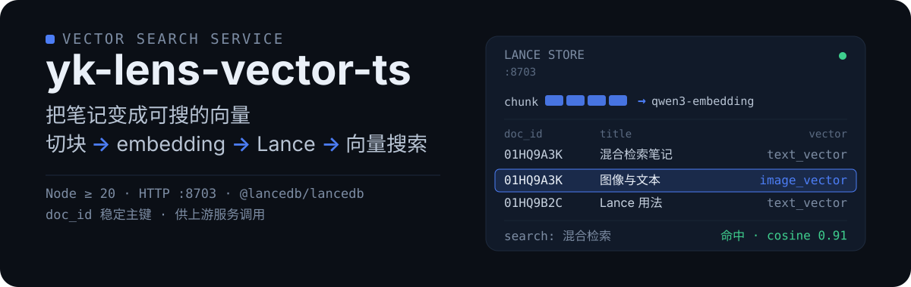
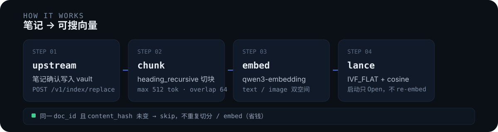

<p align="center">
  
</p>

**yk-lens-vector-ts** 是 yk-lens 的向量服务（TypeScript + **LanceDB 官方 SDK**）：把 vault 里的正式笔记（内部简称 **L1**，与沙箱草稿、聊天记录区分）变成可搜的向量——`heading_recursive` 切块 → Qwen3 embedding → 写入本地 Lance 原生目录 → 提供向量搜索 HTTP。契约与历史 [`yk-vector-go`](../yk-vector-go/) 对齐，可替换使用。

| 要点 | 说明 |
|------|------|
| 端口 | HTTP **`:8703`**；由上游服务调用（前端 / Agent 禁止直连） |
| 主键 | 稳定 **`doc_id`**；`content_hash` 仅做指纹 / 是否重算（skip） |
| 存储 | Lance 本地目录；**启动只 Open，不 re-embed** |
| ANN | **IVF_FLAT + cosine**；文本 / 图像双空间，各自索引 |
| 不做 | 持 vault、写 Meili、hybrid/RRF——都在 lensd 一侧完成 |

---

## 怎么工作

```
正式笔记写入 vault → 上游服务触发 replace → 切块 → embedding → Lance → 向量搜索
```

<p align="center">
  
</p>

- 同一 `doc_id` 且请求里的 `content_hash` 与库内一致 → **跳过**，不重复切分 / 调 embedding / 写库（返回 `skipped: true`）。换模型或重排索引时，由上游服务（如 lensd）reindex 时用 `remove_and_insert` 强制重算。
- 搜索的 hybrid（关键词 + 向量融合 / RRF）在上游服务（如 lensd）做，本服务只出向量侧结果。

---

## 快速启动

```bash
cd yk-lens-vector-ts
npm install

cp configs/yk-lens-vector-ts.example.yaml configs/yk-lens-vector-ts.yaml
# 用 IDE 打开 configs/yk-lens-vector-ts.yaml，填 embedding.api_key（及 base_url / model）
# 本机不需要 export 环境变量（文件已 gitignore）

npm run dev            # 开发
# 或
./scripts/dev.sh start # 走脚本
```

验证：

```bash
curl -s localhost:8703/healthz
```

生产构建：

```bash
npm run build
node dist/index.js --config configs/yk-lens-vector-ts.yaml
```

接入上游（示例：yk-lens 的 lensd 指向本服务）：

```bash
export LENS_VECTOR=http://localhost:8703
```

---

## HTTP 契约

| 方法 | 路径 | 说明 |
|------|------|------|
| `GET` | `/healthz` | lance / embedding / vl / chunks / ann |
| `POST` | `/v1/index/replace` | 按 `doc_id` 整篇替换（hash skip；`async`→202） |
| `POST` | `/v1/index/delete` | 按 `doc_id` 删光（幂等） |
| `POST` | `/v1/index/rename` | 只改 path/title，不重 embed |
| `POST` | `/v1/search` | 文搜文 / 文搜图 / 图搜图 |
| `GET` | `/v1/jobs/:id` | 异步 replace 任务 |
| `GET` | `/v1/admin/tables` | 只读：表清单（rows / dim / indexed） |
| `GET` | `/v1/admin/rows` | 只读：分页扫行（`table` `limit` `offset` `doc_id` `order_by` `order` `group_by=doc_id`） |

写入一篇笔记：

```bash
curl -s -X POST localhost:8703/v1/index/replace -H 'Content-Type: application/json' -d '{
  "doc_id": "01HQEXAMPLE",
  "path": "inbox/notes/foo.md",
  "content_hash": "a3f2...",
  "project": "inbox",
  "title": "foo",
  "content": "---\ndoc_id: 01HQEXAMPLE\n---\n\n# 标题\n\n正文混合检索…",
  "created_at": 1720000000,
  "updated_at": 1720001000
}'
```

向量搜索：

```bash
curl -s -X POST localhost:8703/v1/search -H 'Content-Type: application/json' -d '{
  "query": "混合检索",
  "limit": 20,
  "project": "inbox",
  "mode": "text"
}'
```

Search `mode`：

| mode | 行为 |
|------|------|
| `text` / `text_to_text`（默认） | qwen3-embedding → `text_vector` |
| `text_to_image` | VL 编文本 → `image_vector` |
| `image_to_image` | VL 编图 → `image_vector` |

---

## 为什么是 TS + Lance

LanceDB **官方一等 SDK** 含 Python / TypeScript / Rust；Go 仅社区 CGO。本服务用 `@lancedb/lancedb` 直接读写 **Lance 原生文件**，避免预编译 CGO 与社区绑定风险。

**为什么存储选 Lance（不只是向量）：**

- **多模态同一存储**：文本向量与图像向量共存在 Lance 表里、各自建索引（`text_vector` / `image_vector`），文搜图 / 图搜图不需要第二套库
- **为「图」留路**：Lance 生态的 [lance-graph](https://github.com/lance-format/lance-graph) 让同一份 Lance 数据可直接做 Cypher 属性图遍历——向量检索与知识图谱检索未来共用一套存储，不另起炉灶
- **开放列式格式**：数据是可移植的 Lance 文件，Python / Rust 生态可以直接读同一份数据

| 项 | go（历史） | ts（本仓） |
|----|------------|------------|
| Lance 访问 | 社区 CGO `lancedb-go` | **官方** `@lancedb/lancedb` |
| 默认端口 | 8702 | **8703** |
| 逃生 exact/gob | 有 | **无**（只 Lance） |
| ANN | 进程内 HNSW / CGO 映射 | **锁定 IVF_FLAT + cosine**（[docs/06](docs/06-LANCEDB-USAGE.md)） |
| 切分 / HTTP / 多模态 | 有 | **对齐** |
| 文档 | `yk-vector-go/docs` | **`yk-lens-vector-ts/docs`（权威）** |

> 数据目录不要与 go 实例**同时写同一 `lance_path`**。能否删 go：见 [docs/99-VS-GO-AND-DELETE.md](docs/99-VS-GO-AND-DELETE.md)。

---

## 代码结构

```text
src/
  index.ts              # 入口
  config.ts             # YAML + env
  types.ts              # ChunkRow / SearchHit
  api/server.ts         # Express HTTP
  chunk/headingRecursive.ts
  embed/client.ts       # 文本 embedding
  embed/vl.ts           # 跨模态
  image/extract.ts      # MD 抽图
  store/lanceStore.ts   # Lance 官方 SDK
  store/aggregate.ts    # 文档级折叠
  service/indexService.ts
  service/jobs.ts       # 异步 replace
configs/
scripts/dev.sh
```

---

## 文档

- 本仓 [`docs/`](docs/)（权威，以 [`03-BACKLOG.md`](docs/03-BACKLOG.md) 勾选）
- 根词典 [`docs/00-SHARED-IDS.md`](../docs/00-SHARED-IDS.md)
- 历史 go 文档：`yk-vector-go/docs/`（迁移期保留）
